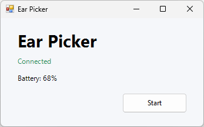
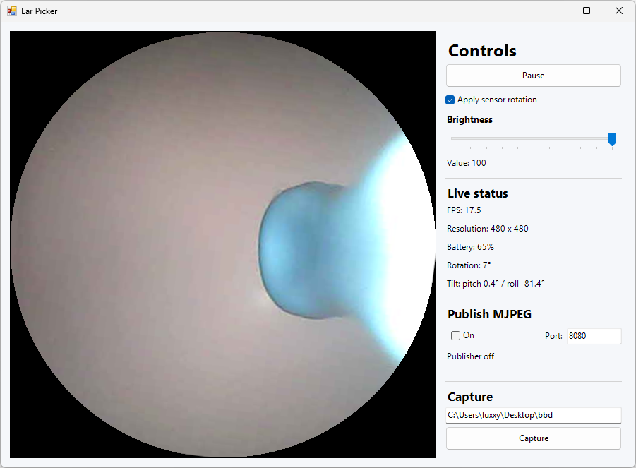

# Ear Picker

**Ear Picker** is a lightweight Windows companion app for a Wi-Fi ear camera. It connects to the device, shows a live circular camera preview that follows the sensor rotation, and makes it easy to adjust brightness, capture images, and optionally share the stream as MJPEG.

## What it does

- Detects the camera and shows its battery status
- Streams live video with sensor-based rotation and tilt readouts
- Adjusts the camera brightness
- Saves both the original JPEG and a rotated circular capture
- Optionally publishes the live feed as an MJPEG stream for a browser or VLC

## Snapshots

### Connected and ready

### Live inspection view

## Quick start

1. Connect this PC to the camera's Wi-Fi network.
2. Run `EarPicker.exe`, or run `build.bat` to rebuild it with the installed .NET Framework compiler.
3. Wait for the device to appear as **Connected**, then select **Start**.
4. Use **Capture** to save images, or enable **Publish MJPEG** to share the live feed on a trusted local network.

> The device address is currently configured as `192.168.5.1` in `DeviceProtocol.cs`.
